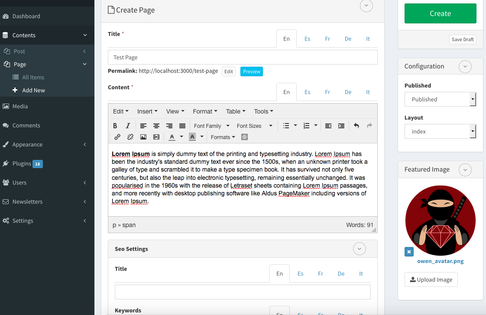

# CAMALEON CMS V2
[Website](http://camaleon.tuzitio.com/)

[Demonstration](http://camaleon.tuzitio.com/plugins/demo_manage/)

  
# Sponsor

[ButterCMS](https://buttercms.com/?utm_source=github&utm_medium=sponsorship-link&utm_campaign=camaleon) is an API-based CMS and blogging platform built for developers:

[](https://buttercms.com/?utm_source=github&utm_medium=sponsorship-banner&utm_campaign=camaleon)


# Requirements
* Rails 4.1+
* MySQL 5+ or SQlite or PostgreSQL
* Ruby 1.9.3+
* Imagemagick

# Installation
* Install Ruby on Rails 4.1+
  [Visit here.](http://railsapps.github.io/installing-rails.html)
* Create your rails project

  ```
  rails new my_project
  ```
* Add the gem in your Gemfile

  ```
  gem "camaleon_cms",  '>= 2.4.3.1' # Stable versions 2.3.6, 2.2.1, 2.1.1, 2.1.0
  # gem "camaleon_cms", github: 'owen2345/camaleon-cms' # current development version
  ```
* Only Rails 5 support
  
  Add in your Gemfile
  ```
  gem 'activemodel-serializers-xml', git: 'https://github.com/rails/activemodel-serializers-xml'
  gem 'draper', github: 'audionerd/draper', branch: 'rails5'
  ```
  Create a file "lib/rails/test_unit/sub_test_task.rb" in your project (draper patch)
  ```
  class Rails::SubTestTask < Rake::TestTask
  end
  ```
  
* Install required Gem and dependencies

  ```
  bundle install
  ```
* Install the CMS (before this, you can change defaut configuration in config/system.json)

  ```
  rails generate camaleon_cms:install
  ```
* Create database structure

  ```
  rake db:migrate
  ```
* Start your server

  ```
  rails server # and then go to your browser http://localhost:3000/
  ```
  Previous stable version (1x): https://github.com/owen2345/camaleon-cms/tree/version_1x


# Camaleon CMS (It adapts to your needs)

Camaleon CMS is a dynamic and advanced content management system based on Ruby on Rails 4 and Ruby 1.9.3+. This CMS is an alternative to wordpress for Ruby on Rails developers to manage advanced contents easily.
Camaleon CMS is a flexible manager where you can build your custom content structure without coding anything by custom fields and custom contents type.

To download or publish themes go to themes store:
http://camaleon.tuzitio.com/store/themes

To download or publish plugins go to plugins store:
http://camaleon.tuzitio.com/store/plugins

## Camaleon CMS is FREE and Open source
It was released on July, 2015 and tested previously with more than 20 projects by 6 months and on august 22, 2015 was published as a gem.



## With Camaleon you can do:
* Multiples sites in the same installation
* Multilanguage sites
* Design and create the architecture of your project without programming by dynamic contents and fields
* Extend or customize the functionalities by plugins
* Manage your content visualization by themes
* Advanced User roles
* Integrate into existent rails 4 projects
* Other features:
  - Shortcodes
  - Widgets
  - Drag and Drop / Sortable / Multi level menus
  - Templates/Layouts for pages
  - Easy migration from wordpress

## Some features are:
* Integrate into existent Ruby on Rails Projects
* Easy administration
  Camaleon CMS permit you to adapt the CMS to all your needs and not you adapt to the CMS.
I.E. you can create your custom architecture with all attributes that you need for each kind of content.
* Security
  - Remote code execution
  - SQL injections
  - Advanced sessions security
  - Cross Site Scripting
  - Control of abusive requests
  - Cross-Site Request Forgery
* Site Speed
  Camaleon CMS include a lot of cache strategies to optimize the site access velocity:
    - Cache contents
    - Cache queries
    - Manifests (compress and join asset files)
    - Customize your content visualization for Desktop, Mobile and Tablet
* SEO & HTML5
  - Sitemap generations
  - Seo Configuration
  - Seo for social media
  - All generated content is compatible with HTML5 and bootstrap 3

## Camaleon CMS come with basic and important plugins like:
* Ecommerce
* Visibility content
* Web attack control
* Contact forms
* Cache content
* Content reorder
* many others [here.](https://github.com/owen2345/Camaleon-CMS-Sample)

## Demonstration
* [Camaleon Server (current version)](http://camaleon.tuzitio.com/plugins/demo_manage/)
* [Deploy in Heroku](https://heroku.com/deploy?template=https://github.com/owen2345/Camaleon-CMS-Sample)

## Support
If you have problems, please enter an issue [here.](https://github.com/owen2345/camaleon-cms/issues)
If you need support, need some extra functionality or need plugins, please contact us on:
* Site: http://camaleon.tuzitio.com/
* Email: owenperedo@gmail.com
* Skype: owen-2345

## Author
Owen Peredo Diaz

## License
http://camaleon.tuzitio.com/license.html

## Coming soon
* Documentation and Videos
* Create/Update Manuals
* TDD (rspec)

## Testing
* Init DB
```
RAILS_ENV=test bundle exec rake app:db:migrate
RAILS_ENV=test bundle exec rake app:db:test:prepare
```
* Configure/Install Poltergaist and change your phanthomjs path in spec/spec_helper.rb

* Run testing
```
rspec
```

## Contributing
* Fork it.
* Create a branch (git checkout -b my_feature_branch)
* Commit your changes (git commit -am "Added a sweet feature")
* Push to the branch (git push origin my_feature_branch)
* Create a pull request from your branch into master (Please be sure to provide enough detail for us to cipher what this change is doing)

Visit the web site for more information: http://camaleon.tuzitio.com/

## Version History
http://camaleon.tuzitio.com/version-history.html
